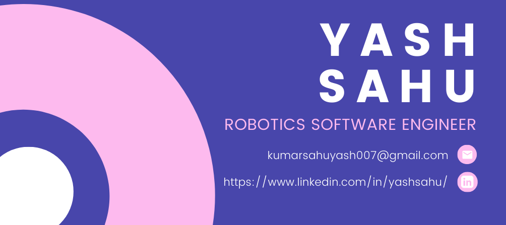

---

# Hi there 👋

Hi, I'm a Robotics Software Engineer at MaRS.
I'm pursuing a major in Computer Science at IIITDM. Right now, I'm working on building an autonomous rover where I implement Computer Vision techniques to help our robot perceive its surroundings.

- 🔭 I’m currently working on **Robot Operating System (ROS)**
- 🌱 I’m currently learning **Computer Science Enginnering** at **IIITDM, KANCHEEPURAM**
- 👯 I’m looking to collaborate on **Robotics Software Development**
- 🤔 I’m looking for help with **Autoware.ai, Autoware.auto**
- 💬 Ask me about **Robotics and Fitness**
- 📫 How to reach me: **E-Mail Me!!**
- 😄 Pronouns: he/him
- 💬 I'm mostly active within the **Robot Operating System (ROS)**, **C++**, **Image Processing**, **Python** and **Gazebo** communities
- ⚡ Fun fact: “Robot” comes from the Czech word robota, meaning“drudgery,” and first appeared in the 1921 play R.U.R.

  

    
    
    
    
    
    
    
    
    
    
   

### 📬 Get in Touch

- GitHub: https://github.com/YashKSahu
- LinkedIn: https://www.linkedin.com/in/yashsahu/
- Site: https://yashkumarsahu.netlify.app/
- E-mail: kumarsahuyash007@gmail.com

### 📚 Looking for my Resume? E-Mail me!

---

